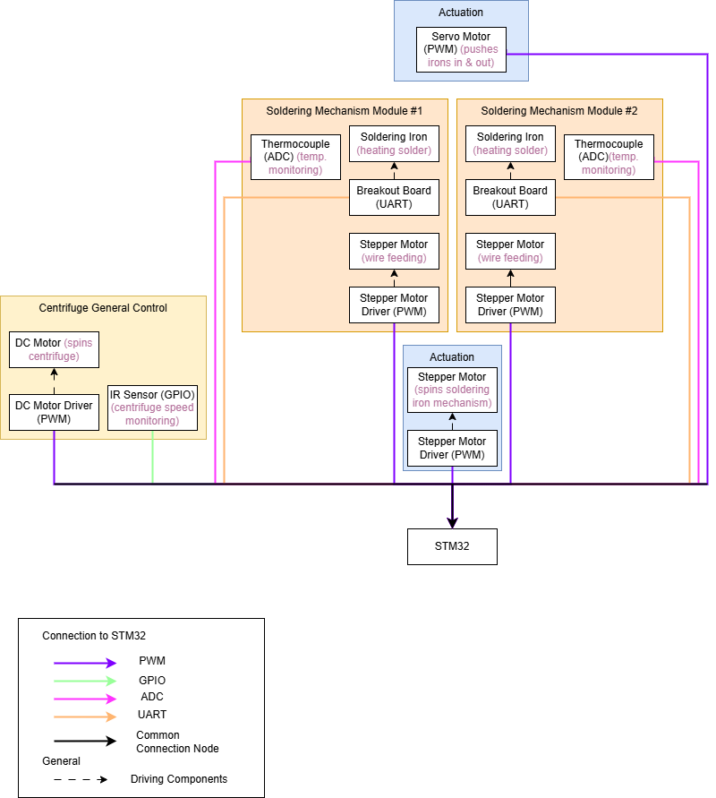
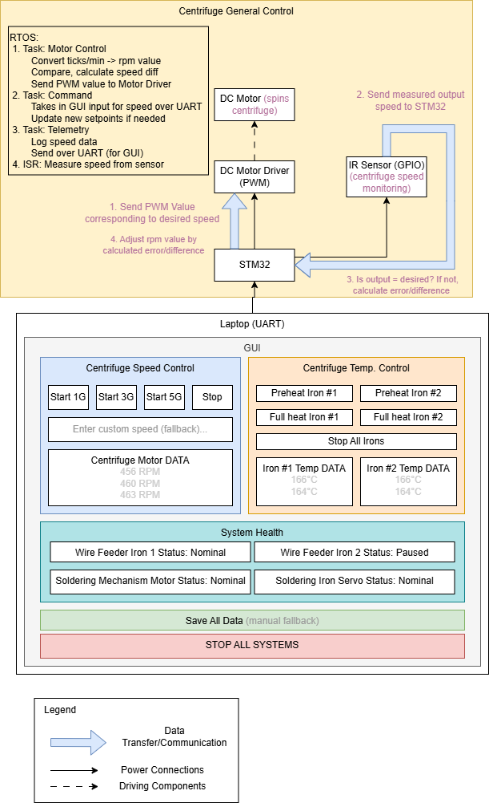

# System Architecture

    

The software subsystem can be divided into 3 components:
* High Level Functionality - interfacing the microcontroller for the mission specialists' use
* Actuation - controlling movement of components within the soldering mechanism (stepper and servos)
* Heating - controlling the heating of the soldering irons

Tool stack includes C/C++, cmake, OpenOCD, gnu embedded toolchain, and python for the GUI.

## System Integration Diagram

    

The high level functionality subsystem can be further divided into 2 components:
* Centrifuge Rotation Control - used to spin the centrifuge as a whole 
* GUI - for the Mission Specialists during the flight, to change rotation speed corresponding to the simulated gravity value, as well as potentially controlling the soldering irons (degree of control during flight is yet to be determined)

Components include a DC Motor, a way to measure speed (TBD between IR Sensor or encoder), a motor driver, as well as the standard STM32
Tool stack includes C/C++, cmake, OpenOCD, gnu embedded toolchain, and python for the GUI.